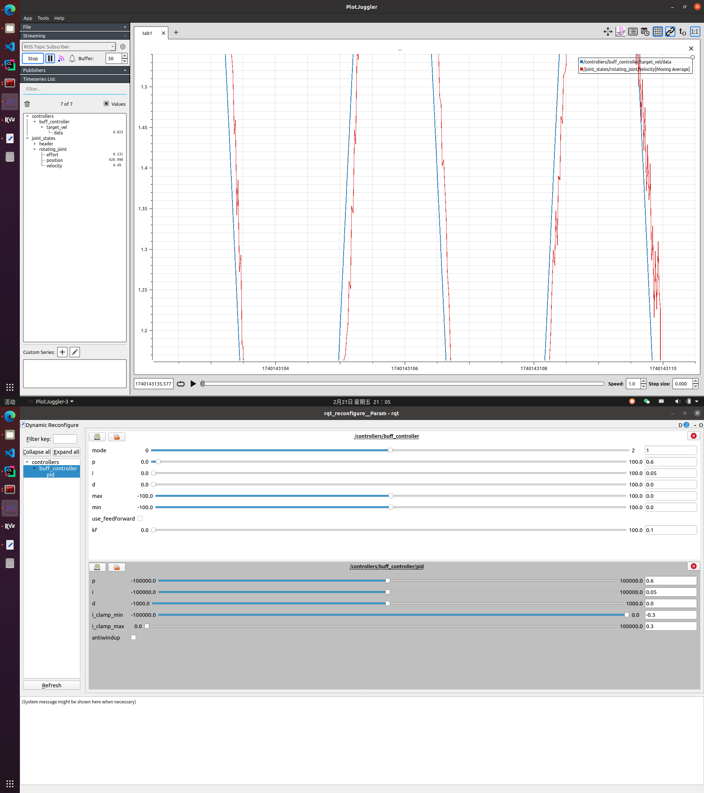
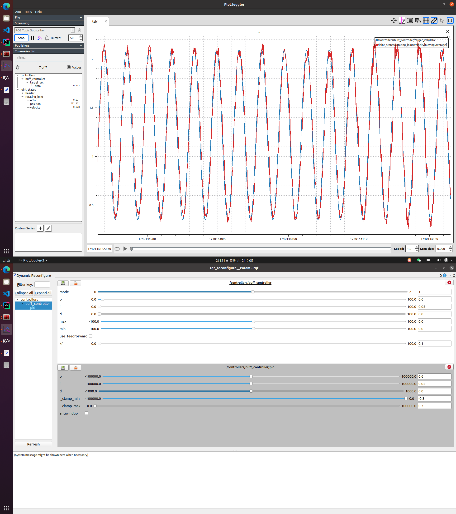
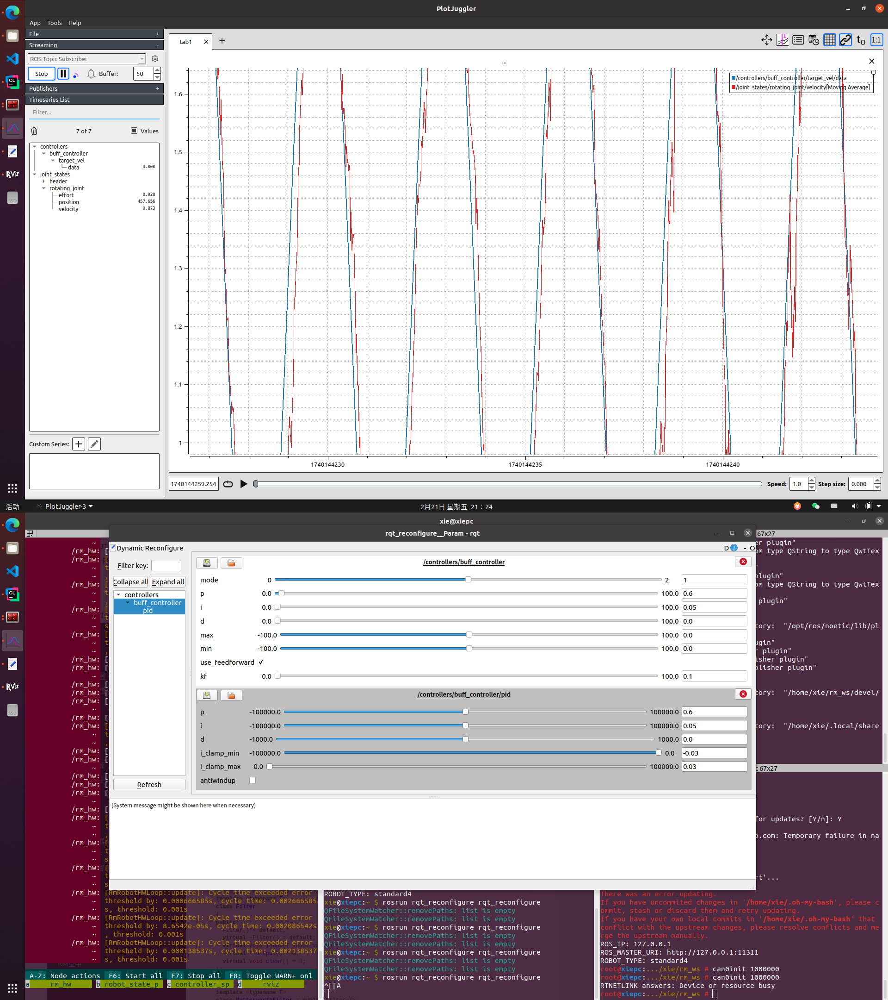

# URDF与电机的连接

​	在ROS（Robot Operating System）与Gazebo仿真环境的集成中，gazebo_ros_control插件扮演了一个关键角色。它作为桥梁，连接了机器人模型和控制算法，使得我们能够在Gazebo中模拟机器人的行为。这个插件通过解析URDF（Unified Robot Description Format）文件中的<transmission>标签，并加载相应的硬件接口和控制器管理器来实现这一目标。

​	具体来说，在URDF文件中，<hardwareInterface>标签用于定义机器人关节或执行器的接口类型。这些接口类型包括位置、速度或力矩（effort）接口，它们分别对应于不同的控制模式：基于位置的控制、基于速度的控制以及基于力矩的控制。

​	ros::NodeHandle(controller_nh, "pid") 创建了一个新的节点句柄，它在 controller_nh 的基础上添加了 "pid" 子命名空间，这样做会形成类似 controller_nh/pid/... 的参数路径

# 在代码中读取关节

```cpp
joint_ = effort_joint_interface->getHandle("rotating_joint");
```

# 使用usb2can连接电机

参照hw的config设置：

```yaml
rm_hw:
  bus:
    - can0
  loop_frequency: 1000
  cycle_time_error_threshold: 0.001
  thread_priority: 50

  actuators:
    rotating_motor:
      bus: can0
      id: 0x204
      type: rm_2006
      lp_cutoff_frequency: 100
```

链接电机后：

```bash
sudo ip link set can1 up type can bitrate 1000000
```

写完控制器后开启launch文件。

# PID调节

### 未使用前馈



### 使用前馈



相较未使用反应更快
